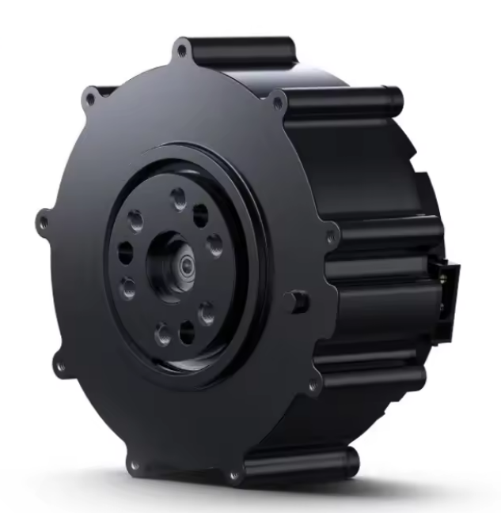

# CyberGear ROS2 Driver

## Overview

This package provides a comprehensive ROS2 driver for CyberGear motors, enabling seamless integration of CyberGear actuators into robotic systems. The driver supports multiple control modes including MIT control and position control, with synchronized multi-motor operation capabilities.

## Features

### Current Features

1. **Multi-Motor Synchronized Control**:
   - Simultaneous control of multiple CyberGear motors
   - Centralized configuration through YAML files
   - Group motor command interface

2. **Multiple Control Modes**:
   - MIT Control Mode for advanced torque control
   - Position Control Mode for precise positioning
   - Configurable control parameters per motor

3. **ROS2 Integration**:
   - Native ROS2 message interfaces
   - Service-based parameter configuration
   - Real-time joint state publishing
   - Standard ROS2 lifecycle management

4. **State Monitoring & Recording**:
   - Joint state recording for analysis with `joint_state_recoder.py`
   - Real-time motor status feedback
   - Motor state tracking and calibration status

6. **Safety Features**:
   - Command timeout protection (0.5s)
   - Automatic motor disable on communication loss
   - Graceful shutdown procedures
   - Error recovery and retry mechanisms

## CyberGear Motor Specifications

### Physical Characteristics
- **Weight**: 317g ±3g
- **Outer Diameter**: Φ80.5mm
- **Height**: 36.5mm
- **Gear Reduction Ratio**: 7.75:1

### Electrical Specifications
- **Rated Voltage**: 24VDC
- **Communication**: CAN Bus at 1Mbps
- **Encoder**: 14-bit single-programmed absolute value encoder
- **Reverse Potential Constant**: 0.054 - 0.057V/rpm
- **Torque Constant**: 0.87N.m/A

### Performance Specifications
- **Continuous Torque**: 4N.m
- **Peak Torque**: 12N.m
- **Maximum Speed**: 296rpm ±10%
- **Maximum Speed at Continuous Torque**: 240rpm ±10

### Current Ratings
- **Continuous Torque Max. Phase Current**: 6.5A ±10%
- **Peak Torque Max. Phase Current**: 23A ±10%

### Performance Ratios
- **Maximum Torque-to-Weight Ratio**: 37.85N.m/kg
- **Maximum Power-to-Weight Ratio**: 511.04W/kg

### Control Range Limits (Driver Configuration)
- **Position Range**: -4π to +4π radians
- **Velocity Range**: -30 to +30 rad/s
- **Current Range**: -12 to +12 A
- **Kp Gain Range**: 0.0 to 10.0
- **Kd Gain Range**: 0.0 to 1.0

### Position Memory & Calibration Important Notes

⚠️ **Critical Calibration Information**:

The CyberGear motor **loses absolute position memory on power failure**. Due to the 7.75:1 gear reduction ratio, the motor operates in **sectors of 2π/7 radians (~0.81 rad)**. 

**Calibration Requirements**:
- **Sector Consistency**: Position calibration must be performed within the same 2π/7 sector each time
- **Power-On Procedure**: After power loss, the motor needs to be manually positioned to a known reference point within the correct sector before calibration
- **Zero Position Setting**: Use `ros2 service call /calibrate std_srvs/srv/Trigger` to set the current position as zero reference

**Why This Matters**:
- The 14-bit absolute encoder provides precise position within each sector
- Gear reduction creates multiple mechanical positions for the same encoder reading
- Inconsistent sector calibration leads to position errors of ±2π/7 radians
- Always calibrate from the same mechanical reference position for repeatability



*CyberGear motor showing compact design and CAN connection*


*Encoder configuration and sector relationship*


*ROS2 node graph showing system architecture*

## Package Structure

The CyberGear driver consists of two main packages:

### cybergear_driver
Main driver package containing:
- **Driver Node**: `cybergear_driver.py` - Main motor control node
- **Configuration**: `config/config.yaml` - Motor setup and parameters
- **Control Library**: `cybergear.py` - Core motor communication library
- **Controller**: `controller.py` - High-level control algorithms
- **Testing Scripts**: MIT and Position control demonstrations
- **Recording Tool**: Joint state recording for analysis

### cybergear_interfaces
Interface definitions package containing:
- **Messages**: Motor control and setpoint message definitions
- **Services**: Parameter setting and motion gain configuration services

## Installation & Setup

### Prerequisites

```bash
# Ensure ROS2 is installed and sourced
source /opt/ros/humble/setup.bash  # or your ROS2 distribution

# Install required Python packages
pip install python-can==4.5.0
pip install canalystii==0.1

# Verify installations
pip show python-can
pip show canalystii
```

**Required Python Dependencies:**
- `python-can` (v4.5.0) - Controller Area Network interface module
  - Dependencies: msgpack, packaging, typing_extensions, wrapt
- `canalystii` (v0.1) - Python userspace driver for CANalyst-II USB CAN analyzer
  - Dependencies: pyusb

**Hardware Requirements:**
- CANalyst-II USB-CAN adapter (default) or compatible CAN interface
- CyberGear motors with CAN communication
- Proper CAN bus termination (120Ω resistors)

```bash
# Create or navigate to your ROS2 workspace
cd ~/OTTO_ws/src  # or your workspace path
```

### Build Instructions

```bash
# Clone the repository (if not already present)
# git clone <your-cybergear-repo-url>

# Build the packages
cd ~/OTTO_ws
colcon build --packages-select cybergear_driver cybergear_interfaces

# Source the workspace
source install/setup.bash
```

### Configuration

1. **Motor Configuration**:
   Edit `cybergear_driver/config/config.yaml` to configure your motors:
   ```yaml
   # CAN Interface Configuration
   can:
     interface: "canalystii"  # Default interface, change if needed
     channel: 0
     bitrate: 1000000
   
   # Motor Configuration
   motors:
     - id: 1
       flip: false
       raw_pos_zero: 0.0
       control_mode: 1
       limit_spd: 30.0
       limit_cur: 23.0
       # Additional motor parameters
     - id: 2
       flip: false
       raw_pos_zero: 0.0
       control_mode: 1
       limit_spd: 30.0
       limit_cur: 23.0
   ```

2. **CAN Interface Setup**:
   - **Default Interface**: `canalystii` (CANalyst-II USB-CAN adapter)
   - **Alternative Interfaces**: You can modify the interface in the config file:
     - `socketcan` for SocketCAN (Linux)
     - `pcan` for PEAK-System CAN interfaces
     - `vector` for Vector CAN interfaces
   - Ensure your CAN interface is properly configured and accessible

## Usage

### Basic Usage

#### 1. Start the CyberGear Driver

```bash
# Terminal 1: Start the main driver node
ros2 run cybergear_driver cybergear_driver.py
```

This command initializes all motors according to the settings in `config/config.yaml` and sets them to idle state.

⚠️ **Important**: After power loss, motors lose absolute position memory. Manually position each motor to the same reference point before starting the driver for consistent calibration.

#### 2. Send Motor Commands

```bash
# Terminal 2: Use control examples

# MIT Control Mode Example
ros2 run cybergear_driver lock_home_mit_control.py

# Position Control Mode Example  
ros2 run cybergear_driver lock_home_position_control.py
```

### Advanced Usage Examples

#### Manual Command Publishing

```bash
# Send direct motor group commands
ros2 topic pub /motor_group_command cybergear_interfaces/msg/MotorControlGroup \
  "{motor_controls: [
    {control_mode: 1, set_point: {position: 1.57, velocity: 0.0, effort: 0.0, kp: 1.0, kd: 0.1}},
    {control_mode: 1, set_point: {position: -1.57, velocity: 0.0, effort: 0.0, kp: 1.0, kd: 0.1}}
  ]}" --once
```

#### State Monitoring and Recording

```bash
# Monitor joint states
ros2 topic echo /joint_states

# Record joint states for analysis
ros2 run cybergear_driver joint_state_recoder.py
```

### Control Modes

- **Mode 0**: MIT Control (Operation) - Advanced torque/impedance control with real-time feedback
- **Mode 1**: Position Control - Precise angular positioning
- **Mode 2**: Speed Control - Velocity-based control  
- **Mode 3**: Current Control - Direct current/torque control
- **Mode 4**: Enable - Activate motor control
- **Mode 5**: Disable - Deactivate motor control
- **Mode 6**: Set Parameter - Zero position and parameter setting

### Testing Examples

#### MIT Control Mode
```bash
ros2 run cybergear_driver lock_home_mit_control.py
```
This example demonstrates MIT control with torque feedback and impedance control.

#### Position Control Mode
```bash
ros2 run cybergear_driver lock_home_position_control.py
```
This example demonstrates precise position control with configurable gains.

## Message Interfaces

### MotorControlGroup.msg
```
MotorControl[] motor_controls
```

### MotorControl.msg
```
uint8 control_mode
SetPoint set_point
```

### SetPoint.msg
```
float32 position
float32 velocity
float32 effort
float32 kp
float32 kd
```

## Service Interfaces

### SetParam.srv
Configure motor parameters, control modes, and enable/disable motors.
```
# Request
uint8 motor_id              # 0 for all motors, specific ID for individual motor
uint8 control_mode          # 0-6 control modes
uint8 communication_type    # 8 or 18 for different parameter types
string param_name           # Parameter name to set
float32 param_value         # Parameter value
---
# Response
bool success
string message
```

### Trigger.srv (Calibration)
Calibrate all motors to set their zero positions.

⚠️ **Critical**: Due to position memory loss on power failure, always calibrate from the same mechanical reference position within the same 2π/7 sector to maintain accuracy.

## File Descriptions

### Core Files
- `cybergear_driver.py` - Main ROS2 driver node with multi-motor management and 500Hz control loop
- `cybergear.py` - Low-level CAN communication library implementing CyberGear protocol
- `controller.py` - High-level control algorithms, state management, and motor coordination
- `config.py` - Configuration file parser and parameter management

### Configuration
- `config/config.yaml` - Central configuration file for CAN interface and motor parameters

### Testing & Control Scripts
- `lock_home_mit_control.py` - MIT control mode demonstration with torque feedback
- `lock_home_position_control.py` - Position control mode demonstration

### Monitoring & Recording
- `joint_state_recoder.py` - Record joint states for analysis and visualization

## System Architecture

```
┌──────────────────────┐    ┌──────────────────────┐    ┌─────────────────────┐
│  motor_control_group │    │ /motor_group_command │    │ cybergear_driver    │
│     _publisher       │───▶│                      │───▶│     _node           │
└──────────────────────┘    └──────────────────────┘    └─────────────────────┘
                                                                     │
                            ┌──────────────────────┐                │
                            │   /joint_states      │◀───────────────┘
                            └──────────────────────┘
                                       │
                            ┌──────────▼───────────┐
                            │ joint_state_recoder  │
                            └──────────────────────┘

                            Services:
                            ┌──────────────────────┐
                            │    /setparam         │
                            │    /calibrate        │
                            └──────────────────────┘
```

## Troubleshooting

### Common Issues

#### 1. CAN Interface Not Found
```bash
# For CANalyst-II (default interface)
# Check USB connection and device recognition
lsusb | grep -i can

# For SocketCAN interfaces
ip link show
sudo ip link set can0 up type can bitrate 1000000
```

#### 2. CAN Interface Configuration
If you need to change from the default `canalystii` interface, edit `config/config.yaml`:
```yaml
can:
  interface: "socketcan"    # Change to your interface type
  channel: "can0"          # Change channel as needed
  bitrate: 1000000         # Adjust bitrate if required
```

Supported interfaces:
- `canalystii` - CANalyst-II USB-CAN adapter (default)
- `socketcan` - Linux SocketCAN
- `pcan` - PEAK-System CAN interfaces  
- `vector` - Vector CAN interfaces

#### 3. Motor Communication Timeout
- Verify CAN connections and termination resistors
- Check motor power supply and CAN bus voltage levels
- Ensure correct motor IDs in configuration file
- Verify CAN bitrate matches motor configuration (default: 1Mbps)

#### 4. Permission Denied on CAN Interface
```bash
# Add user to appropriate groups (for SocketCAN)
sudo usermod -a -G dialout $USER
# For CANalyst-II, ensure USB permissions
sudo udevadm control --reload-rules
# Then logout and login again
```

#### 5. Position Calibration Issues After Power Loss
```bash
# The motor loses absolute position on power failure
# Always calibrate from the same mechanical reference position

# Step 1: Manually position motor to known reference point
# Step 2: Calibrate the zero position
ros2 service call /calibrate std_srvs/srv/Trigger

# Step 3: Verify calibration
ros2 topic echo /joint_states
```

**Important**: Due to the 7.75:1 gear ratio, calibration must occur within the same 2π/7 sector (~0.81 rad) each time to maintain position accuracy. Inconsistent sector calibration can result in position errors.

#### 6. Configuration File Not Found
```bash
# Verify config file path in the package
ros2 pkg prefix cybergear_driver
ls $(ros2 pkg prefix cybergear_driver)/share/cybergear_driver/config/

# Check if config.yaml exists and is readable
cat $(ros2 pkg prefix cybergear_driver)/share/cybergear_driver/config/config.yaml
```

### Debugging Commands

```bash
# Check active topics
ros2 topic list

# Monitor motor commands
ros2 topic echo /motor_group_command

# Check node status
ros2 node list
ros2 node info /cybergear_driver_node

# Verify message interfaces
ros2 interface show cybergear_interfaces/msg/MotorControlGroup
```

## Performance Notes

- **Control Frequency**: 500Hz control loop for real-time performance
- **CAN Bus Speed**: Default 1Mbps, configurable in config.yaml
- **Multi-Motor Support**: Tested with up to 6 motors simultaneously
- **Real-time Performance**: Optimized for low-latency motor control with Best Effort QoS
- **Joint State Publishing**: 500Hz for real-time feedback

## Configuration Parameters

### CAN Interface Parameters
- `interface`: CAN interface type (default: "canalystii")
- `channel`: CAN channel number or device name
- `bitrate`: CAN bus bitrate in bps (default: 1000000)

### Motor Parameters
- `id`: Unique motor identifier (1-127)
- `flip`: Reverse motor direction (true/false)
- `raw_pos_zero`: Zero position offset in radians
- `control_mode`: Default control mode (0-6)
- `limit_spd`: Maximum speed limit (rad/s)
- `limit_cur`: Maximum current limit (A)

### Control Gains (automatically set during setup)
- `loc_kp`: Position control proportional gain (default: 1.25)
- `spd_kp`: Speed control proportional gain (default: 1.0)
- `spd_ki`: Speed control integral gain (default: 0.05)

## Safety Features

- **Emergency Stop**: Immediate motor shutdown capability
- **Position Limits**: Software-enforced position boundaries
- **Torque Limiting**: Configurable maximum torque protection
- **Communication Watchdog**: Automatic stop on communication loss
- **Error Recovery**: Automatic error handling and recovery

## Code Architecture & Flow

### CyberGear Driver Node Flow

The `cybergear_driver.py` implements the main ROS2 node with the following execution flow:

```
┌─────────────────────────────────────────────────────────────────┐
│                    Node Initialization                          │
├─────────────────────────────────────────────────────────────────┤
│ 1. Load config.yaml                                            │
│ 2. Initialize CyberGearController                              │
│ 3. Setup motors (disable, set limits, set gains)              │
│ 4. Cache motor IDs and names for performance                   │
└─────────────────┬───────────────────────────────────────────────┘
                  │
┌─────────────────▼───────────────────────────────────────────────┐
│                Service & Publisher Setup                        │
├─────────────────────────────────────────────────────────────────┤
│ • /setparam service (motor control & parameter setting)        │
│ • /calibrate service (zero position calibration)               │
│ • /joint_states publisher (500Hz, Best Effort QoS)             │
│ • /motor_group_command subscriber (Reliable QoS)               │
└─────────────────┬───────────────────────────────────────────────┘
                  │
┌─────────────────▼───────────────────────────────────────────────┐
│                 Main Timer Loop (500Hz)                        │
├─────────────────────────────────────────────────────────────────┤
│ 1. Check command timeout (0.5s)                               │
│    └─ If timeout: disable all motors                          │
│ 2. Periodic logging (every 50 cycles = 10Hz)                  │
│ 3. Get joint states from all motors via CAN                   │
│ 4. Publish JointState message                                  │
└─────────────────┬───────────────────────────────────────────────┘
                  │
                  ▼
         ┌─────────────────┐         ┌─────────────────┐
         │  Command Flow   │         │  Service Flow   │
         └─────────────────┘         └─────────────────┘
                  │                           │
┌─────────────────▼───────────────────────────▼───────────────────┐
│              Command Callback                                   │
├─────────────────────────────────────────────────────────────────┤
│ 1. Validate message (motor count)                              │
│ 2. Auto-enable motors if any disabled                          │
│ 3. Create command dictionary {motor_id: MotorControl}          │
│ 4. Send to controller.send_group_command()                     │
│ 5. Update last command timestamp                               │
└─────────────────┬───────────────────────────────────────────────┘
                  │
┌─────────────────▼───────────────────────────────────────────────┐
│              Controller Layer                                   │
├─────────────────────────────────────────────────────────────────┤
│ • Apply calibration offsets                                    │
│ • Handle motor direction flipping                              │
│ • Send individual motor commands via CAN                       │
│ • Track motor states (enabled/disabled/mode)                   │
└─────────────────┬───────────────────────────────────────────────┘
                  │
┌─────────────────▼───────────────────────────────────────────────┐
│                CAN Communication                                │
├─────────────────────────────────────────────────────────────────┤
│ • Type 1 (MIT Control): torque + position + velocity + gains   │
│ • Type 18 (Position): loc_ref parameter                        │
│ • Type 18 (Velocity): spd_ref parameter                        │
│ • Type 18 (Current): iq_ref parameter                          │
│ • Type 2 (Feedback): position, velocity, current reading       │
│ • Type 3/4 (Enable/Disable): motor state control               │
└─────────────────────────────────────────────────────────────────┘
```

### Key Performance Optimizations

1. **Pre-allocated Data Structures**: Motor IDs, names, and JointState messages are cached
2. **Efficient QoS Profiles**: Best Effort for high-frequency joint states, Reliable for commands
3. **Batch Operations**: Group commands processed together for synchronized motor control
4. **State Caching**: LRU cache for motor states to reduce redundant queries
5. **Timeout Management**: Automatic motor disable after 0.5s command timeout for safety

### Control Flow Details

#### Motor Command Processing
```
MotorControlGroup → validate → auto-enable → send_group_command → CAN
     │                │            │              │               │
     └─ motor_controls └─ count     └─ enable_motor └─ command_motor └─ type1_si/type18
```

#### Joint State Publishing
```
Timer (500Hz) → get_joint_states → CAN type2 → apply_transforms → publish
      │              │                │            │               │
      └─ 2ms cycle    └─ all motors   └─ feedback  └─ flip/offset  └─ /joint_states
```

#### Service Handling
```
/setparam → dispatch_table → {control_mode, enable/disable, param_setting}
    │            │                     │           │            │
    └─ request   └─ mode 0-6          └─ 0-3      └─ 4-5      └─ 6
```

### Error Handling & Safety

- **Command Timeout**: Motors automatically disabled after 0.5s without commands
- **CAN Error Recovery**: Automatic retry and error logging for failed communications  
- **State Validation**: Motor count and message validation before processing
- **Graceful Shutdown**: All motors disabled on node termination or Ctrl+C

## Development & Contributing

### Adding New Control Modes
1. Extend the `MotorControl` message definition
2. Implement control logic in `controller.py`
3. Add example scripts demonstrating usage

## License & Support

For technical support and feature requests, please refer to the project repository issues page.

## Additional Documentation

For comprehensive technical documentation, motor specifications, and advanced usage examples, refer to:
- **CyberGear Documentation**: [https://github.com/belovictor/cybergear-docs/blob/main/instructionmanual/instructionmanual.md](https://github.com/belovictor/cybergear-docs/blob/main/instructionmanual/instructionmanual.md)

## Changelog

### Latest Updates
- Multi-motor synchronized control implementation
- MIT control mode integration
- Real-time state monitoring and recording
- Comprehensive example collection
- Service-based parameter configuration

---

**Note**: Ensure proper safety measures when working with robotic actuators. Always test in a controlled environment before deployment.